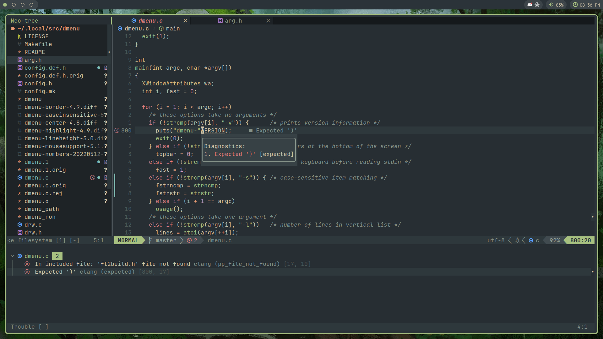

# nvim
my neovim configuration


# dependencies
these are all probably available in your distrobutions package manager
* neovim >= 0.8.0
* git
* ripgrep 
* g++
* a nerd font *(optional)*
* xclip/any other clipboard manager *(optional)*

# installation script
it is recommended you use a posix compliant shell to run this such as dash, but it doesnt matter too much.
```sh
sh <(curl -s https://raw.githubusercontent.com/corey-truscott/nvim-config/main/install.sh)
```

# list of plugins
<details>
  <summary>View list</summary>

* autopairs
* barbar
* barbecue
* cmp
* cmp-nvim-lsp
* colorizer
* comment
* dressing
* emmet
* fugitive
* gitsigns
* lsp-zero
* lspconfig
* lualine
* luasnip
* mason
* mason-lspconfig
* mason-null-ls
* mini.starter
* navic
* nightfox
* noice
* notify
* nui
* null-ls
* nvim-tree
* orgmode
* persistence
* playground
* plenary
* repeat
* speeddating
* surround
* telescope
* toggleterm
* transparent
* treesitter
* trouble
* ts-context-commentstring
* undotree
* web-devicons
* which key
* yankassassin

</details>

# window transparency
if you want neovim to be transparent, use the command `:TransparentToggle`

# other
TODO: add info about neorg
